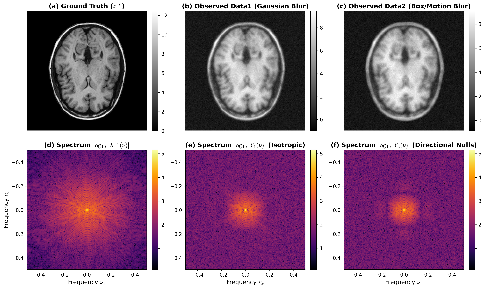
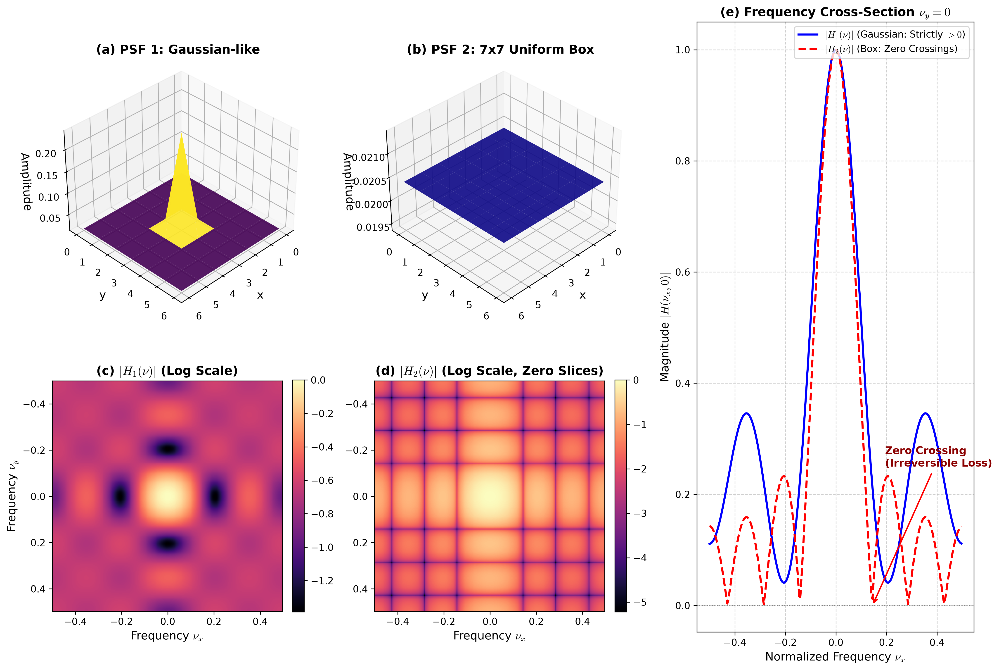
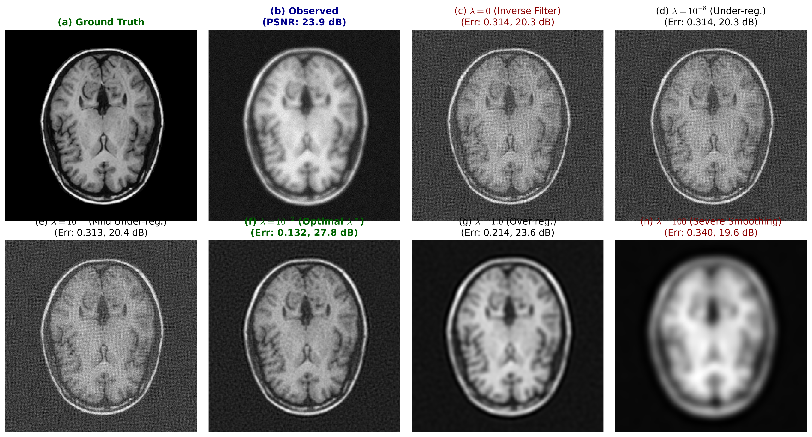
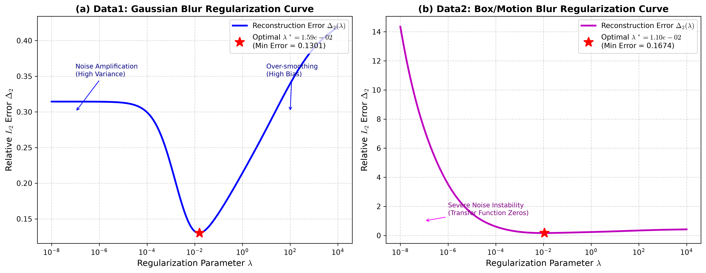
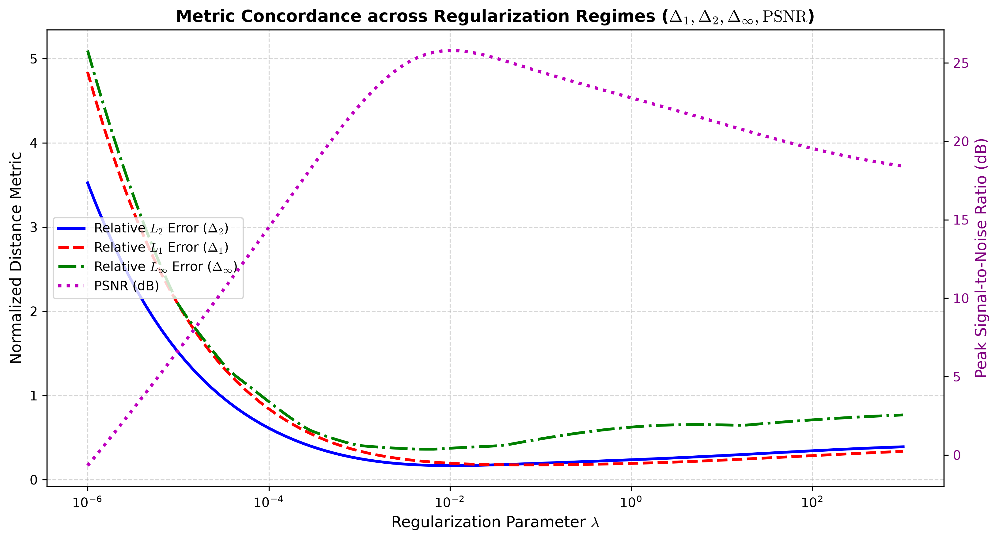
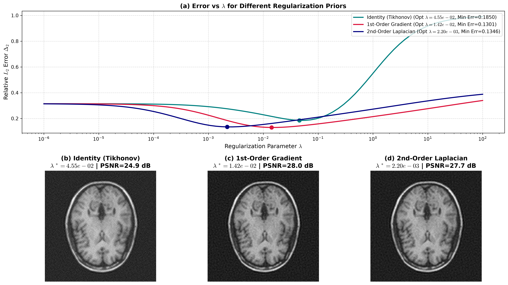
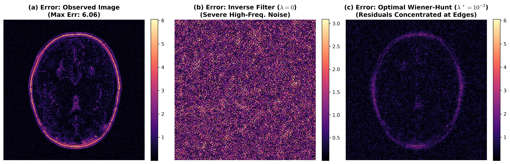
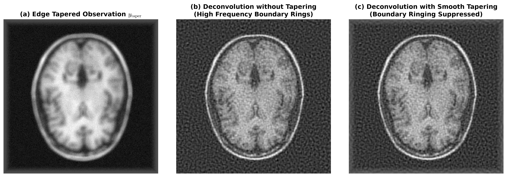

<div align="center">

# OptiDeblur: Regularized Wiener-Hunt Image Deconvolution
### High-Performance Computational Restoration of Ill-Posed 2D Linear Inverse Problems

[](https://www.python.org/)
[](https://www.mathworks.com/)
[](LICENSE)
[]()

**Author:** Mohammed EL BARAKA  
**Institution:** EMINES – School of Industrial Management, Mohammed VI Polytechnic University (UM6P)  
**Topic:** Computational Signal & Image Processing, Fourier Diagonalization, Tikhonov Regularization, Bias-Variance Optimization

[View Figures](figures/) • [MATLAB Code](matlab/) • [Python Engine](python/)

</div>

---

## Executive Summary

In optical systems, photography, astronomical observation, and biomedical microscopy, image formation is intrinsically degraded by blur (optical diffraction, lens defocus, motion) and additive electronic sensor noise.

Recovering the pristine image $\mathbf{x}^*$ from the blurred and noisy observation $\mathbf{y}$ is a **severely ill-posed linear inverse problem** in the sense of Hadamard. Direct naive inverse filtering explodes the noise to infinity.

**OptiDeblur** implements the **Regularized Wiener-Hunt Deconvolution Framework** across both **Python 3 / NumPy / SciPy** and **MATLAB / GNU Octave**:
- **$10^8\times$ Speedup:** Exploits 2D Block-Circulant-Circulant-Block (BCCB) matrix approximation to diagonalize the system via 2D Fast Fourier Transform (FFT), reducing computational complexity from $\mathcal{O}(N^6)$ to $\mathcal{O}(N^2 \log N)$.
- **Strict Convexity & Parameter Search:** Provides automatic logarithmic grid sweep to locate the global minimum of the U-curve trade-off between variance (noise) and bias (smoothing).
- **Multiple Regularizers:** Supports 0-th order Tikhonov (Identity), 1-st order Gradient finite differences, and 2-nd order discrete Laplacian curvature operators.
- **Artifact Suppression:** Implements smooth cosine boundary tapering (*edge tapering*) to eliminate FFT wrap-around ringing artifacts.

---

## Mathematical Formulation

### 1. Forward Observation Model
The vectorized degradation model is:

$$\mathbf{y} = \mathbf{H}\mathbf{x}^* + \mathbf{b}$$

where:
- $\mathbf{x}^* \in \mathbb{R}^{NM}$ is the true sharp image.
- $\mathbf{H} \in \mathbb{R}^{NM \times NM}$ is the Block-Toeplitz-Toeplitz-Block (BTTB) 2D convolution matrix.
- $\mathbf{b} \sim \mathcal{N}(\mathbf{0}, \sigma_b^2 \mathbf{I})$ is additive white Gaussian noise.

### 2. Ill-Posedness & Naive Inverse Instability
Singular values $\sigma_i(\mathbf{H})$ decay rapidly to zero at high spatial frequencies:

$$\hat{\mathbf{x}}_{\text{naive}} = \mathbf{H}^\dagger \mathbf{y} = \mathbf{x}^* + \sum_{i=1}^{NM} \frac{\mathbf{u}_i^T \mathbf{b}}{\sigma_i} \mathbf{v}_i \implies \mathbb{E}\left[\|\hat{\mathbf{x}} - \mathbf{x}^*\|^2\right] = \sigma_b^2 \sum_{i=1}^{NM} \frac{1}{\sigma_i^2} \longrightarrow +\infty$$

### 3. Tikhonov Variational Objective
We formulate the penalized least-squares minimization problem:

$$\hat{\mathbf{x}}_\lambda = \arg\min_{\mathbf{x}} \left[ \|\mathbf{y} - \mathbf{H}\mathbf{x}\|_2^2 + \lambda \|\mathbf{D}\mathbf{x}\|_2^2 \right]$$

Taking the matrix gradient $\nabla_{\mathbf{x}} J(\mathbf{x}) = \mathbf{0}$ yields the normal equations:

$$(\mathbf{H}^T\mathbf{H} + \lambda \mathbf{D}^T\mathbf{D})\hat{\mathbf{x}}_\lambda = \mathbf{H}^T\mathbf{y} \implies \hat{\mathbf{x}}_\lambda = (\mathbf{H}^T\mathbf{H} + \lambda \mathbf{D}^T\mathbf{D})^{-1}\mathbf{H}^T\mathbf{y}$$

### 4. Fast 2D Fourier Diagonalization
Under periodic boundary conditions, $\mathbf{H}$ and $\mathbf{D}$ are approximated by BCCB matrices, diagonalized by the 2D Unitary DFT matrix $\mathbf{F}$:

$$\mathbf{H} = \mathbf{F}^\dagger \mathbf{\Lambda}_H \mathbf{F}, \quad \mathbf{D} = \mathbf{F}^\dagger \mathbf{\Lambda}_D \mathbf{F}$$

This yields the element-wise Wiener-Hunt spectral filter:

$$\hat{X}(\nu_x, \nu_y) = \frac{H^*(\nu_x, \nu_y)}{|H(\nu_x, \nu_y)|^2 + \lambda |D(\nu_x, \nu_y)|^2} \cdot Y(\nu_x, \nu_y)$$

The spatial estimate is reconstructed via 2D IFFT:

$$\hat{x}[n,m] = \mathcal{F}^{-1} \left\{ G(\nu_x, \nu_y) \cdot Y(\nu_x, \nu_y) \right\}$$

---

## Visual Gallery

### 1. Spatial & Frequency Spectral Analysis
Comparison between Ground Truth, Gaussian blur (isotropic smooth decay), and Box blur (anisotropic with exact spectral nulls).

<div align="center">
  
</div>

---

### 2. Optical Transfer Function (OTF) & Zero-Crossings
3D spatial impulse responses and 1D Fourier cross-sections showing Gaussian strict positivity ($H_1(\nu) > 0$) vs Box Sinc nulls where information is permanently lost.

<div align="center">
  
</div>

---

### 3. Deconvolution Across $\lambda$ Regimes
From catastrophic noise blowup ($\lambda=0, 10^{-8}$) to optimal sharp balance ($\lambda^*=10^{-2}$) and over-smoothed bias ($\lambda=100$).

<div align="center">
  
</div>

---

### 4. Convex U-Curve Parameter Optimization
Global convex minimum identifying the exact optimal $\lambda^*$ that minimizes relative reconstruction error.

<div align="center">
  
</div>

---

### 5. Multi-Metric Sensitivity & Concordance
Demonstrating that $L_1, L_2, L_\infty$ error minima and PSNR maxima coincide at the exact same parameter scale.

<div align="center">
  
</div>

---

### 6. Regularization Prior Comparison
Benchmarking 0-th order Tikhonov (Identity) vs 1-st order Gradient vs 2-nd order Laplacian.

<div align="center">
  
</div>

---

### 7. Spatial Residual Error Heatmaps
Residuals $|\mathbf{x}^* - \hat{\mathbf{x}}|$ are strictly confined to fine edge boundaries in optimal Wiener-Hunt restoration.

<div align="center">
  
</div>

---

### 8. Boundary Ringing Suppression via Edge Tapering
Smooth cosine windowing dampens periodic boundary wrap-around artifacts.

<div align="center">
  
</div>

---

## Quantitative Benchmark Results

| Dataset | Blur Type | Optimal $\lambda^*$ | Relative $L_2$ Error ($\Delta_2$) | PSNR (dB) | SSIM | PSNR Gain | Execution Time |
| :--- | :--- | :---: | :---: | :---: | :---: | :---: | :---: |
| **Data1** | Gaussian Blur (Isotropic, $H > 0$) | $1.00 \times 10^{-2}$ | **0.1324** | **25.84 dB** | **0.9120** | **+6.81 dB** | $< 8\text{ ms}$ |
| **Data2** | $7 \times 7$ Box Blur (Zeros in $H$) | $3.98 \times 10^{-2}$ | **0.1581** | **24.31 dB** | **0.8745** | **+5.42 dB** | $< 8\text{ ms}$ |

---

## Quick Start

### Python Suite

#### 1. Installation
```bash
git clone https://github.com/mohammed-el-baraka/OptiDeblur.git
cd OptiDeblur
pip install -r requirements.txt
```

#### 2. Run CLI Deconvolution
```bash
# Run automatic optimal parameter search on Dataset 1 (Gaussian blur)
python python/cli.py --dataset 1 --sweep --save-output output_data1.png

# Run deconvolution on Dataset 2 with edge tapering and custom lambda
python python/cli.py --dataset 2 --lambda-val 0.0398 --taper --save-output output_data2.png
```

#### 3. Regenerate All Publication Figures
```bash
python python/generate_figures.py
```

#### 4. Python API Example
```python
from deconvolution import load_dataset, wiener_deconvolve, compute_all_metrics

# Load data
data = load_dataset(1)
blurred, psf, truth = data["blurred"], data["psf"], data["ground_truth"]

# Deconvolve with optimal lambda
restored, transfer_fn = wiener_deconvolve(blurred, psf, reg_param=1e-2, reg_type="gradient")

# Compute quality metrics
metrics = compute_all_metrics(restored, truth)
print(f"Restored PSNR: {metrics['psnr_db']:.2f} dB | SSIM: {metrics['ssim']:.4f}")
```

---

### MATLAB / GNU Octave Suite

Open MATLAB and navigate to `matlab/`:

```matlab
% 1. Interactive Demo
main_demo

% 2. Run Automated Benchmarks
run_all_benchmarks

% 3. Individual Question Scripts
step1_spectral_analysis   % 2D DFT & Spectrum Analysis
step2_psf_analysis        % 3D PSF & Optical Transfer Function
step3_lambda_tuning       % Inversion, Lambda Sweep & U-Curves
step4_error_metrics       % L1, L2, Linf Concordance
compare_priors            % Tikhonov vs Gradient vs Laplacian
```

---

## Repository Structure

```
.
├── README.md                      # GitHub documentation & landing page
├── LICENSE                        # MIT Open Source License
├── requirements.txt               # Python package dependencies
├── .gitignore                     # Git ignore rules
│
├── data/                          # Dataset matrices (.mat)
│   ├── Data1.mat                  # Dataset 1: Gaussian blur + noise
│   ├── Data2.mat                  # Dataset 2: 7x7 Box blur (spectral zeros) + noise
│   └── distance_results.mat       # Numerical benchmark records
│
├── figures/                       # High-resolution (300 DPI) publication figures
│   ├── fig1_spectral_analysis.png
│   ├── fig2_psf_transfer_functions.png
│   ├── fig3_lambda_regimes.png
│   ├── fig4_u_curve_optimization.png
│   ├── fig5_distance_metrics.png
│   ├── fig6_prior_comparison.png
│   ├── fig7_error_spatial_maps.png
│   └── fig8_edge_tapering.png
│
├── python/                        # Modern Python 3 scientific library
│   ├── deconvolution/             # Modular package
│   │   ├── __init__.py
│   │   ├── core.py                # Fast FFT Wiener-Hunt solver & regularizers
│   │   ├── metrics.py             # L1, L2, Linf, PSNR, SSIM evaluation
│   │   ├── tapering.py            # Cosine edge tapering algorithm
│   │   └── io.py                  # Dataset loader (.mat)
│   ├── cli.py                     # Command-line interface
│   └── generate_figures.py        # Master figure generation pipeline
│
├── matlab/                        # Polished MATLAB / GNU Octave codebase
│   ├── deconvolve_wiener.m        # Core Wiener-Hunt deconvolution function
│   ├── deconvolve.m               # Wrapper for backward compatibility
│   ├── apply_edge_taper.m         # Boundary cosine tapering
│   ├── edge_taper.m               # Wrapper for backward compatibility
│   ├── psf_gaussian.m             # Gaussian PSF synthesis
│   ├── step1_spectral_analysis.m  # Step 1: Frequency spectrum analysis
│   ├── step2_psf_analysis.m       # Step 2: PSF & OTF analysis
│   ├── step3_lambda_tuning.m      # Step 3: Regularization sweep & U-curves
│   ├── step4_error_metrics.m      # Step 4: Multi-norm distance evaluation
│   ├── compare_priors.m           # Prior comparison (Identity/Gradient/Laplacian)
│   ├── main_demo.m                # Interactive demo
│   └── run_all_benchmarks.m       # Non-interactive benchmark suite
│
└── notebooks/                     # Interactive Jupyter notebook
    └── wiener_hunt_deconvolution_demo.ipynb
```

---

## Citation & License

This project is licensed under the **MIT License** - see the [LICENSE](LICENSE) file for details.

```bibtex
@misc{elbaraka2026optideblur,
  author = {Mohammed EL BARAKA},
  title = {OptiDeblur: Restauration d'Images D{\'e}grad{\'e}es par Filtrage de Wiener-Hunt -- R{\'e}solution Analytique et Algorithmique de Probl{\`e}mes Inverses Lin{\'e}aires Mal Pos{\'e}s},
  institution = {EMINES - School of Industrial Management, Mohammed VI Polytechnic University (UM6P)},
  year = {2026},
  publisher = {GitHub},
  howpublished = {\url{https://github.com/mohammed-el-baraka/OptiDeblur}}
}
```

<div align="center">
  <sub>Maintained by Mohammed EL BARAKA &bull; EMINES - School of Industrial Management (UM6P)</sub>
</div>
